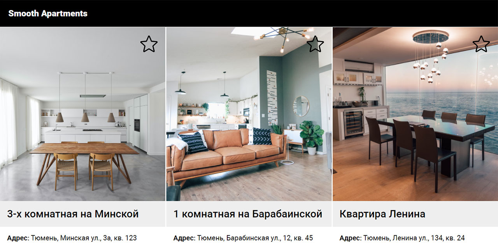

# Smooth Apartments showcase
**A sample frontend project on React-TypeScript-Redux**



A sample apartments showcase application demonstrating responsive layout and imitating asynchronous data fetch.

* Current live version at [https://cat-street.github.io/creative-apartments](https://cat-street.github.io/creative-apartments)

---

## Usage
* Installing dependencies:
```
npm install
```
* Run in development mode:
```
npm start
```

## Features

* A basic showcase with responsive layout
* Imitates API data fetching by using a JSON file
* Apartments data is held in a global state
* Simple adding to favorites functionality

## Technology

* React (functional components, hooks)
* Redux (Toolkit, useSelector, useDispatch hooks)
* TypeScript
* JavaScript (ES6)
* SCSS Modules
